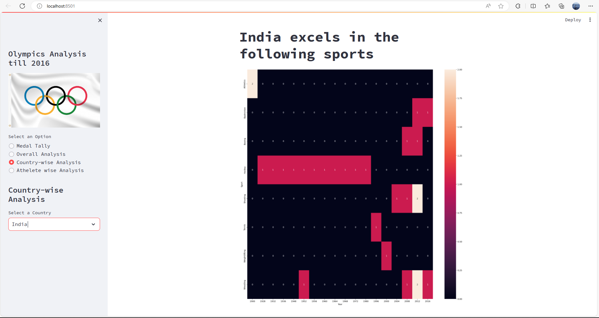
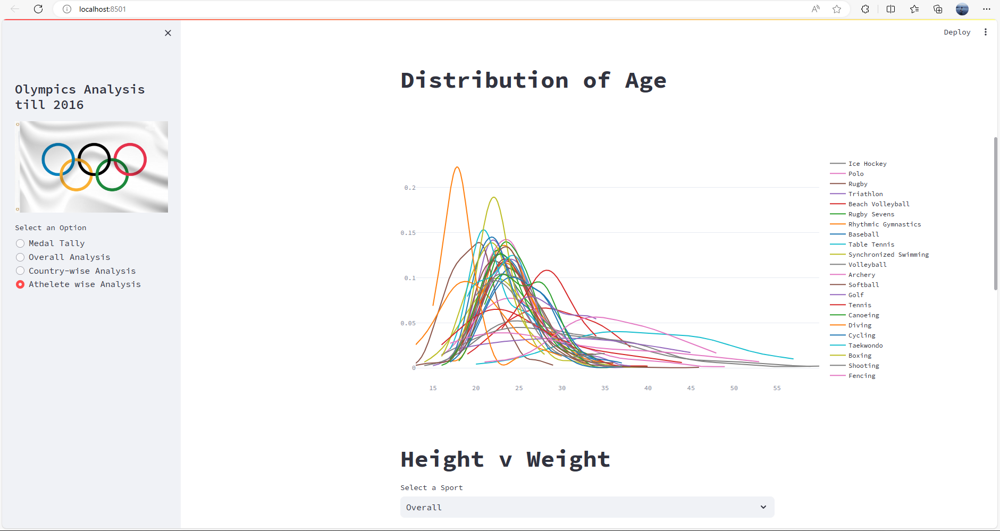

# Olympics Data Analysis Project
!{olympic}(flag-Olympic-Games.webp)

## Overview

This repository contains a data analysis project on the Olympics, spanning from the inception of the modern Olympics to the 2016 edition. The analysis explores various aspects of the Olympics, including medal distributions, trends over the years, and athlete performances.

## Table of Contents

- [Project Description](#project-description)
- [Live Demo](#live-demo)
- [Features](#features)
- [Installation](#installation)
- [Usage](#usage)
- [Data Sources](#data-sources)
- [Screenshots](#screenshots)
- [Contributing](#contributing)
- [License](#license)

## Project Description

The goal of this project is to provide insights into the historical data of the Olympics. It includes exploratory data analysis, visualization, and statistical analysis to uncover patterns, trends, and interesting facts about the Olympic Games.

## Live Demo

Check out the live demo of the project [here](#your-live-demo-link).

## Features

- **Historical Analysis:** Explore trends in the number of participating countries, athletes, and events over the years.
- **Medal Distribution:** Visualize the distribution of gold, silver, and bronze medals across different countries and sports.
- **Athlete Performances:** Analyze the performance of top athletes and identify notable achievements.
- **Geographical Insights:** Map the geographical distribution of medal-winning countries.

## Installation

To run this project locally, follow these steps:

1. Clone the repository:

   ```bash
   git clone https://github.com/your-username/olympics-data-analysis.git
   ```

2. Install the required dependencies:

   ```bash
   pip install -r requirements.txt
   ```

3. Run the project:

   ```bash
   python main.py
   ```

## Usage

Describe how to use your project, including any configuration options or parameters.

```bash
python main.py --option value
```

## Data Sources

The analysis is based on data sourced from [your-data-source-link]. Please refer to the respective data sources for terms of use and licensing information.

## Screenshots

Include a few screenshots or visualizations from your project. For example:




## Contributing

If you would like to contribute to this project, please follow the [contribution guidelines](CONTRIBUTING.md).

## License

This project is licensed under the [MIT License](LICENSE).

---

Feel free to replace the placeholder text and links with your actual project details. This template provides a structure for presenting key information about your Olympics data analysis project on GitHub.
